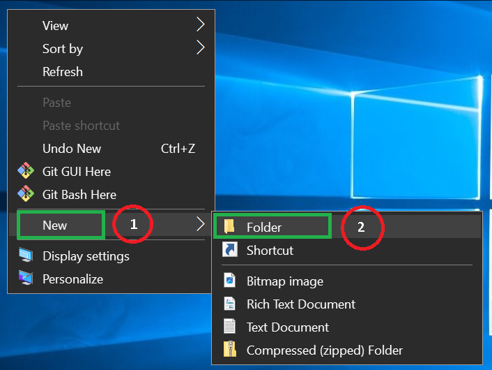
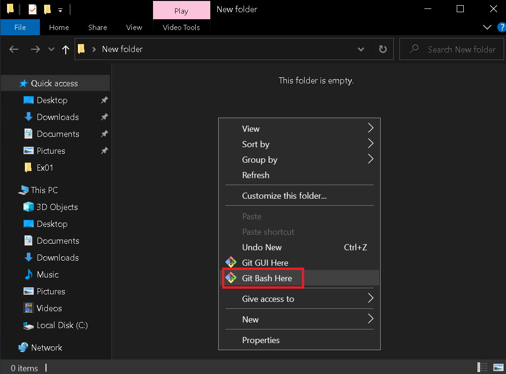
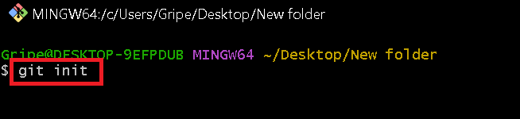
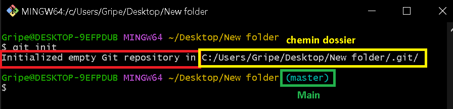
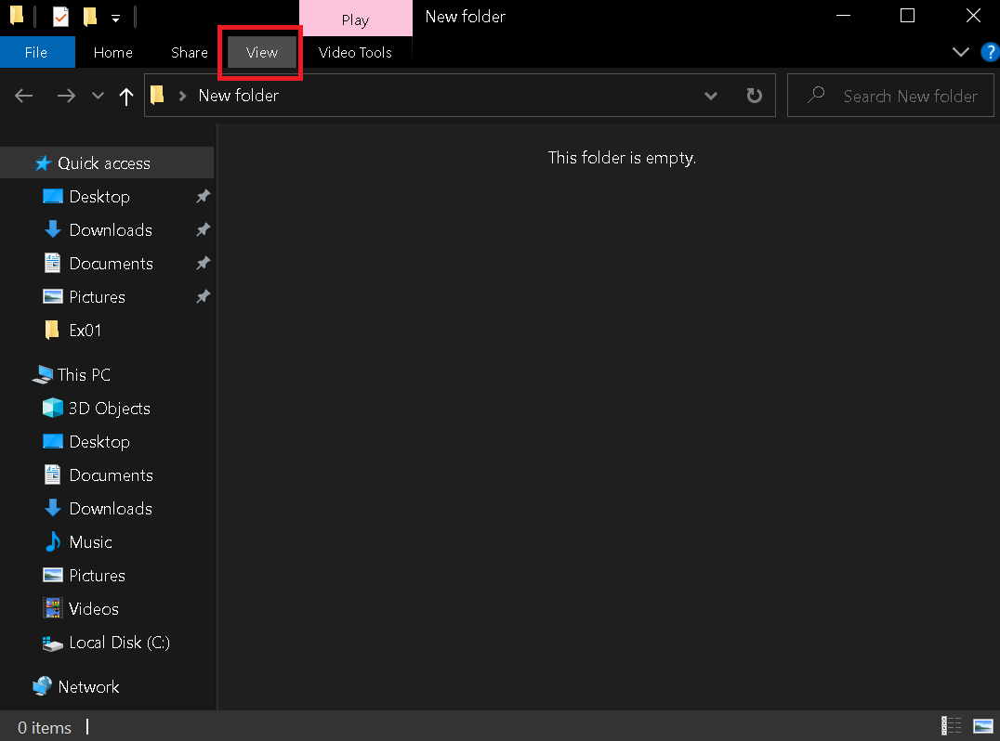
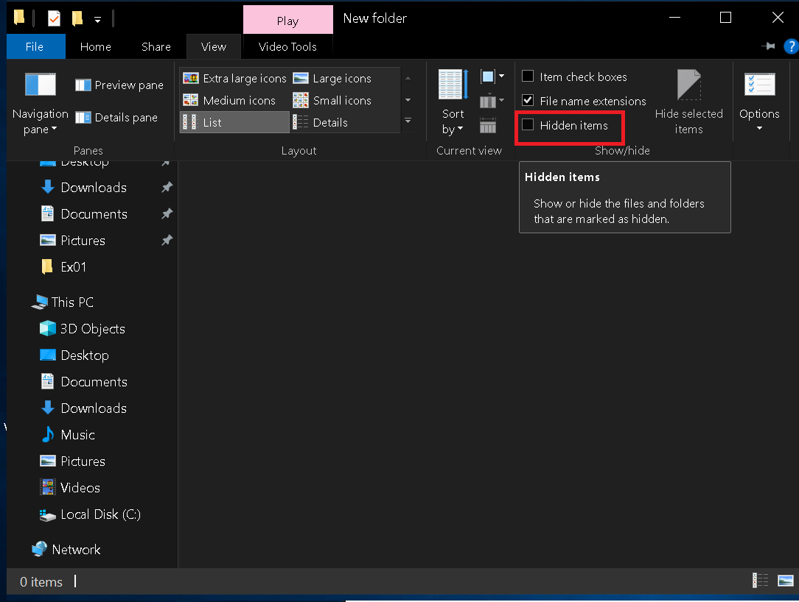
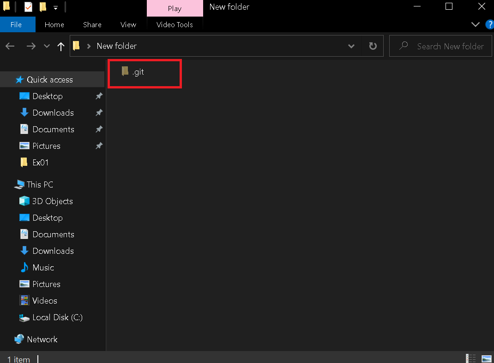
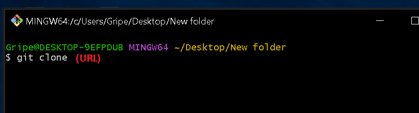
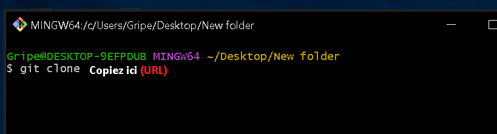

> # ⬛ Setting up a repository 

### 📜 sommaire :

- Initialisation d'un nouveau dépôt Git
- Clonage d'un dépôt Git existant
- Valider une version modifiée d'un fichier dans le dépôt
- Configuration d'un dépôt Git pour la collaboration à distance
- Commandes courantes de contrôle de version Git

## Qu'est-ce qu'un dépôt Git ❔
>**Abrite tous les project sur un serveur, il archive toutes les versions des fichiers stockes.**

## Initialiser un nouveau référentiel(_repository_) :
+ **Etape 1 :**
    > créer le dossier :

    

    > Ouvrez le dossier et faites un clic droit pour ouvrir le menu et cliquez sur Git bash Ici:

    

+ **Etape 2 :**

    Pour créer un nouveau dépôt, vous utiliserez le <code style="color:black;">**git init**</code> commande. <code style="color:black;">**git init**</code> est une commande unique que vous utilisez lors de la configuration initiale d'un nouveau dépôt. L'exécution de cette commande créera un nouveau <code style="color:black;">**.git**</code> sous-répertoire dans votre répertoire de travail actuel. Cela créera également un nouveau <code style="color:black;">**main**</code> bifurquer. 
        
        
    * Comment afficher un dossier 📁 : **``.git``**
        + **Etap 1 :**
            > Cliquez sur l'icône : **View**

            
        + **Etap 2 :**

            >Cliquez ou sélectionnez : **Hidden items** pour afficher tous les fichiers cachés

            

            > Tous les fichiers cachés sont affichés : 

            

## Cloner un dépôt existant : git clone:
- **``git clone``** est utilisé pour créer une copie ou un clone de référentiels distants. Vous transmettez à git clone une **URL** de référentiel.
    - **Etap 1 :** 
        - Tapez la commande suivante : **``git clone <repo url>``**

            
    - **Etap 2 :** 
        - Accédez aux référentiels et cliquez sur l'icône du bouton **(<>code)**

            
    - **Etap 3 :**
        - Copier le lien **URL**
            
    - **Etap 4 :**
        - Revenez à la ligne de commande bash et copiez l'URL
            