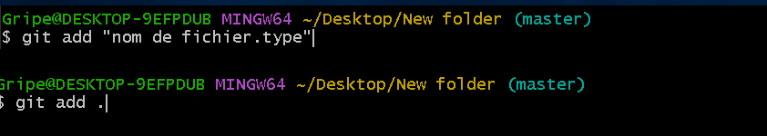
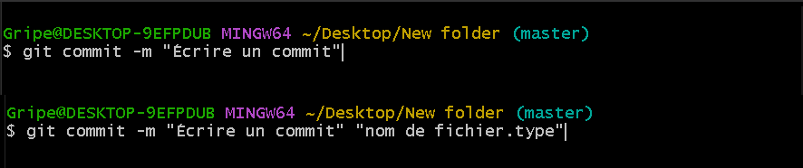

> # ⬛ Setting up a repository 

### 📜 sommaire :

- Initialisation d'un nouveau dépôt Git
- Clonage d'un dépôt Git existant
- Valider une version modifiée d'un fichier dans le dépôt
- Configuration d'un dépôt Git pour la collaboration à distance
- Commandes courantes de contrôle de version Git


## Qu'est-ce qu'un dépôt Git ❔
>**Abrite tous les project sur un serveur, il archive toutes les versions des fichiers stockes.**

## Initialiser un nouveau référentiel(_repository_) :
+ **Etape 1 :**
    > créer le dossier :

    

    > Ouvrez le dossier et faites un clic droit pour ouvrir le menu et cliquez sur Git bash Ici:

    

+ **Etape 2 :**

    Pour créer un nouveau dépôt, vous utiliserez le <code style="color:black;">**git init**</code> commande. <code style="color:black;">**git init**</code> est une commande unique que vous utilisez lors de la configuration initiale d'un nouveau dépôt. L'exécution de cette commande créera un nouveau <code style="color:black;">**.git**</code> sous-répertoire dans votre répertoire de travail actuel. Cela créera également un nouveau <code style="color:black;">**main**</code> bifurquer.<br>
        
        
    * Comment afficher un dossier 📁 : **``.git``**
        + **Etap 1 :**
            > Cliquez sur l'icône : **View**

            
        + **Etap 2 :**

            >Cliquez ou sélectionnez : **Hidden items** pour afficher tous les fichiers cachés

            

            > Tous les fichiers cachés sont affichés : 

            


## Cloner un dépôt existant : git clone:
- **``git clone``** est utilisé pour créer une copie ou un clone de référentiels distants. Vous transmettez à git clone une **URL** de référentiel.
    - **Etap 1 :** 
        - Tapez la commande suivante : **``git clone <repo url>``**

            
    - **Etap 2 :** 
        - Accédez aux référentiels et cliquez sur l'icône du bouton **(<>code)**

            
    - **Etap 3 :**
        - Copier le lien **URL**
            
    - **Etap 4 :**
        - Revenez à la ligne de commande bash et copiez l'URL
            


## Sauvegarde des modifications dans le référentiel : git add et git commit :


- Premier command git add :
    - git add ➡ Ajouter un nouveau fichier à votre zone (**Staging area**)
    - **``git add <nom de fichier.type>``** ou **``git add .``** :

        
    

- Deuxième  command git add :
    - git commit ➡ Ajoute des modifications par étapes à votre local (**Repository**)
    - **``git commit -m "Écrire un commit"``** ou **``git commit -m "Écrire un commit" <nom de fichier.type>``** :
        
        

## Collaboration de dépôt à dépôt : git push

+ Il est important de comprendre que l’idée de « copie de travail » de Git est très différente de la copie de travail que vous obtenez en extrayant le code source d’un référentiel SVN. Contrairement à SVN, Git ne fait aucune distinction entre les copies de travail et le référentiel central : ce sont tous des référentiels Git à part entière.

+ Il est important de comprendre que l’idée de « copie de travail » de Git est très différente de la copie de travail que vous obtenez en extrayant le code source d’un référentiel SVN. Contrairement à SVN, Git ne fait aucune distinction entre les copies de travail et le référentiel central : ce sont tous des référentiels Git à part entière.

+ Bien sûr, rien ne vous empêche de donner une signification particulière à certains dépôts Git. Par exemple, en désignant simplement un dépôt Git comme dépôt « central », il est possible de répliquer un flux de travail centralisé à l’aide de Git. Ceci est accompli par le biais de conventions plutôt que d'être câblé dans le VCS lui-même.

## Configuration et installation : git config

Une fois que vous avez configuré une mise en pension à distance, vous devrez ajouter une URL de dépôt distant à votre local ``git config`` et définir une branche en amont pour vos succursales locales. La commande ``git remote`` offre un tel utilitaire.
````bash
    git remote add <remote_name> <remote_repo_url>  
````
Cette commande mappera le référentiel distant à ``<remote repo url>`` à une référence dans votre dépôt local sous ``<remote_name>``. Une fois que vous avez mappé le dépôt distant, vous pouvez y envoyer des branches locales.
````bash
    git push -u <remote_name> <local_branch_name> 
````

En plus de configurer une URL de dépôt distant, vous devrez peut-être également définir des options de configuration globales de Git telles que le nom d'utilisateur ou l'adresse e-mail. La commande ``git config`` vous permet de configurer votre installation Git (ou un référentiel individuel) à partir de la ligne de commande. Cette commande peut tout définir, des informations utilisateur aux préférences en passant par le comportement d'un référentiel. Plusieurs options de configuration courantes sont répertoriées ci-dessous.<br>
Git stocke les options de configuration dans trois fichiers distincts, ce qui vous permet d'étendre les options à des référentiels individuels (local), à un utilisateur (global) ou à l'ensemble du système (système) :

- Local: ``/.git/config`` – Repository-specific settings.
- Global: ``/.gitconfig`` – User-specific settings. This is where options set with the --global flag are stored.
- System: ``$(prefix)/etc/gitconfig`` – System-wide settings.

L'ajout de l'option `--local` ou le fait de ne pas transmettre du tout une option de niveau de configuration définira le `user.name` ou `user.email` pour le référentiel local actuel.
```bash
    git config --local user.name <name>
```
```bash
    git config --local user.email <email>
```


Définissez le nom de l'auteur ou email à utiliser pour tous les commits dans le référentiel actuel. En règle générale, vous souhaiterez utiliser l' ``--global``indicateur pour définir les options de configuration pour l'utilisateur actuel.

````bash
    git config --global user.name <name>
````
````bash
    git config --global user.email <email>
````


Ouvrez le fichier de configuration globale dans un éditeur de texte pour une édition manuelle. Un guide détaillé sur la façon de configurer un éditeur de texte à utiliser par Git peut être trouvé sur lePage de configuration Git

````bash
    git config --global --edit
````