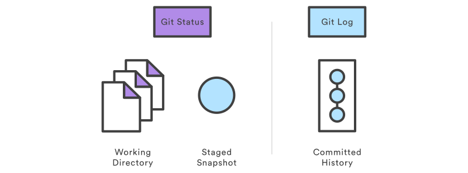

> # ⬛ Inspection 

## ▶ git status :

La commande ``git status`` affiche l'état du répertoire de travail et de la zone de transit. Il vous permet de voir quelles modifications ont été effectuées, lesquelles ne l’ont pas été et quels fichiers ne sont pas suivis par Git. La sortie d'état ne vous montre aucune information concernant l'historique du projet validé. Pour cela, vous devez utiliser ``git log``.

- git log
    - La commande ``git log`` affiche les instantanés validés. Il vous permet de répertorier l'historique du projet, de le filtrer et de rechercher des modifications spécifiques.

## Usage
```bash
    git status
```
Répertoriez les fichiers préparés, non préparés et non suivis.

## Discussion

La commande ``git status`` est une commande relativement simple. Cela vous montre simplement ce qui se passe avec ``git add`` et ``git commit``. Les messages d'état incluent également des instructions pertinentes pour la mise en attente/désactivation des fichiers. Un exemple de sortie montrant les trois catégories principales d'un appel « git status » est inclus ci-dessous :

```bash
    # On branch main
    # Changes to be committed:
    # (use "git reset HEAD <file>..." to unstage)
    #
    #modified: hello.py
    #
    # Changes not staged for commit:
    # (use "git add <file>..." to update what will be committed)
    # (use "git checkout -- <file>..." to discard changes in working directory)
    #
    #modified: main.py
    #
    # Untracked files:
    # (use "git add <file>..." to include in what will be committed)
    #
    #hello.pyc
```

## Ignoring Files

Les fichiers non suivis se répartissent généralement en deux catégories. Il s'agit soit de fichiers qui viennent d'être ajoutés au projet et qui n'ont pas encore été validés, soit de fichiers binaires compilés comme `.pyc`, `.obj`,` .exe`, etc. Bien que ce soit certainement bénéfique pour incluez le premier dans la sortie `git status`, le second peut rendre difficile la visualisation de ce qui se passe réellement dans votre référentiel.

Pour cette raison, Git vous permet d'ignorer complètement les fichiers en plaçant les chemins dans un fichier spécial appelé « .gitignore ». Tous les fichiers que vous souhaitez ignorer doivent être inclus sur une ligne distincte et le symbole * peut être utilisé comme caractère générique. Par exemple, l'ajout de ce qui suit à un fichier `.gitignore` à la racine de votre projet empêchera les modules Python compilés d'apparaître dans `git status` :
```bash
    *.pyc
```
**Exemple**
C'est une bonne pratique de vérifier l'état de votre référentiel avant de valider des modifications afin de ne pas valider accidentellement quelque chose que vous n'avez pas l'intention de faire. Cet exemple affiche l'état du référentiel avant et après la préparation et la validation d'un instantané :
```bash
    # Edit hello.py
    git status
    # hello.py is listed under "Changes not staged for commit"
    git add hello.py
    git status
    # hello.py is listed under "Changes to be committed"
    git commit
    git status
    # nothing to commit (working directory clean
```

La première sortie d'état affichera le fichier comme non préparé. L'action ``git add`` sera reflétée dans le deuxième ``git status``, et la sortie d'état finale vous indiquera qu'il n'y a rien à valider — le répertoire de travail correspond à la validation la plus récente. Certaines commandes Git (par exemple ``git merge``) nécessitent que le répertoire de travail soit propre afin que vous n'écrasiez pas accidentellement les modifications.


## git log
La commande ``git log`` affiche les instantanés validés. Il vous permet de répertorier l'historique du projet, de le filtrer et de rechercher des modifications spécifiques. Alors que ``git status`` vous permet d'inspecter le répertoire de travail et la zone de transit, ``git log`` ne fonctionne que sur l'historique validé.
{width=500 heigth=500}
La sortie du journal peut être personnalisée de plusieurs manières, du simple filtrage des validations à leur affichage dans un format entièrement défini par l'utilisateur. Certaines des configurations les plus courantes de `git log` sont présentées ci-dessous.
## Usage
```bash
    git log
```
Affichez l'intégralité de l'historique des validations en utilisant le formatage par défaut. Si la sortie occupe plus d’un écran, vous pouvez utiliser `Espace` pour faire défiler et `q` pour quitter.
```bash
    git log -n <limit>
```
Limitez le nombre de commits par . Par exemple, ``git log -n 3`` affichera seulement 3 commits.

Condensez chaque commit sur une seule ligne. Ceci est utile pour obtenir un aperçu de haut niveau de l’historique du projet.
```bash
    git log --oneline
```
```bash
    git log --stat
```
En plus des informations ordinaires du ``git log``, indiquez quels fichiers ont été modifiés et le nombre relatif de lignes qui ont été ajoutées ou supprimées de chacun d'eux.
```bash
    git log -p
```
Affichez le patch représentant chaque commit. Cela montre la différence complète de chaque commit, ce qui constitue la vue la plus détaillée que vous puissiez avoir de l'historique de votre projet.
```bash
    git log --author="<pattern>"
```
Recherchez les commits d'un auteur particulier. L'argument ``＜pattern＞`` peut être une chaîne simple ou une expression régulière.
```bash
    git log <since>..<until>
```
Afficher uniquement les commits qui se produisent entre ``< depuis >`` et ``< jusqu'à >``. Les deux arguments peuvent être soit un identifiant de commit, soit un nom de branche, ``HEAD``
```bash
    git log <file>
```
Afficher uniquement les commits qui incluent le fichier spécifié. C'est un moyen simple de voir l'historique d'un fichier particulier.
```bash
    git log --graph --decorate --oneline
```
Quelques options utiles à considérer. L'indicateur --graph qui dessinera un graphique textuel des validations sur le côté gauche des messages de validation. --decorate ajoute les noms des branches ou des balises des commits affichés. --oneline affiche les informations de validation sur une seule ligne, ce qui facilite la navigation parmi les validations d'un seul coup d'œil.