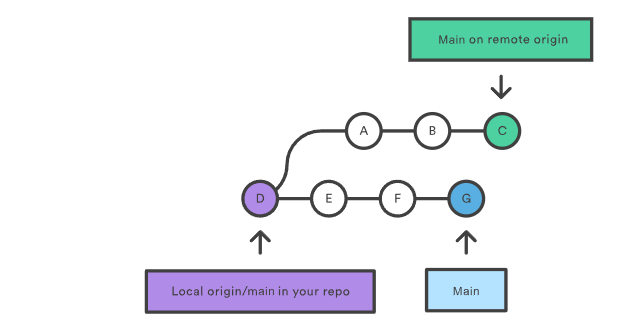
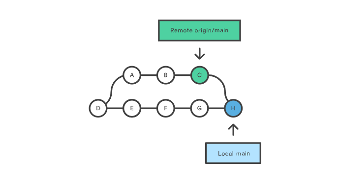
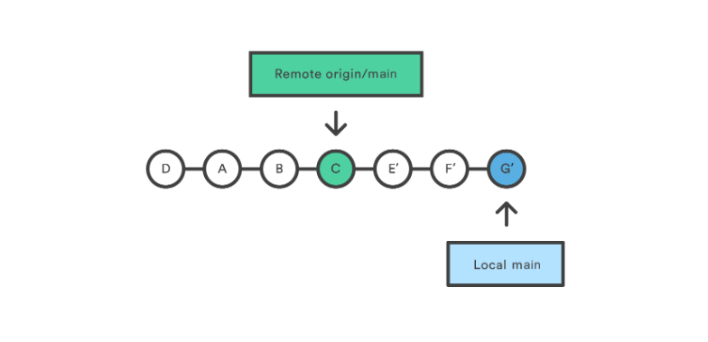
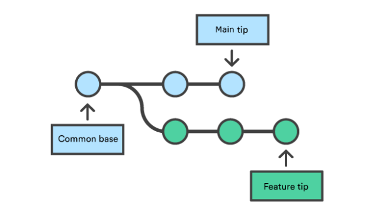
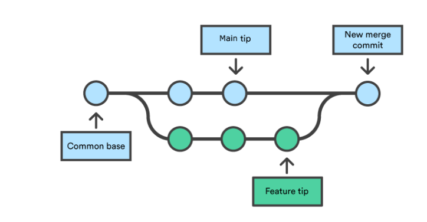
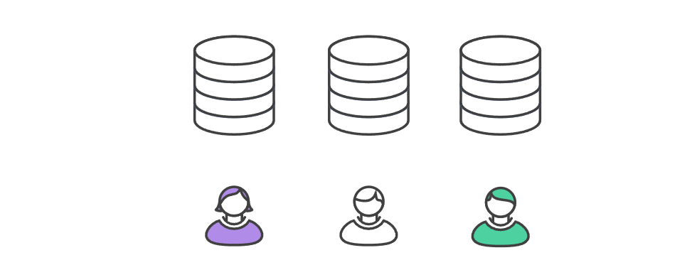

> # ✅Collaborating 

##  1.Git pull:
The ``git pull`` command is used to fetch and download content from a remote repository and immediately update the local repository to match that content. Merging remote upstream changes into your local repository is a common task in Git-based collaboration work flows. The ``git pull ``command is actually a combination of two other commands, git fetch followed by ``git merge``. In the first stage of operation git pull will execute a git fetch scoped to the local branch that HEAD is pointed at. Once the content is downloaded, git pull will enter a merge workflow. A new merge commit will be-created and ``HEAD`` updated to point at the new commit.

### 🏁 Git pull usage: 
#####How it works
The ``git pull`` command first runs ``git fetch ``which downloads content from the specified remote repository. Then a ``git merge`` is executed to merge the remote content refs and heads into a new local merge commit. To better demonstrate the pull and merging process let us consider the following example. Assume we have a repository with a main branch and a remote origin.

In this scenario, ``git pull ``will download all the changes from the point where the local and main diverged. In this example, that point is E. ``git pull`` will fetch the diverged remote commits which are A-B-C. The pull process will then create a new local merge commit containing the content of the new diverged remote commits.

In the above diagram, we can see the new commit H. This commit is a new merge commit that contains the contents of remote A-B-C commits and has a combined log message. This example is one of a few git pull merging strategies. A ``--rebase`` option can be passed to ``git pull`` to use a rebase merging strategy instead of a merge commit. The next example will demonstrate how a rebase pull works. Assume that we are at a starting point of our first diagram, and we have executed ``git pull --rebase``.

In this diagram, we can now see that a rebase pull does not create the new H commit. Instead, the rebase has copied the remote commits A--B--C and rewritten the local commits E--F--G to appear after them them in the local origin/main commit history.

***************
##  2.Git Merge:
Merging is Git's way of putting a forked history back together again. The ``git merge`` command lets you take the independent lines of development created by ``git branch`` and integrate them into a single branch.

Note that all of the commands presented below merge into the current branch. The current branch will be updated to reflect the merge, but the target branch will be completely unaffected. Again, this means that git merge is often used in conjunction with ``git checkout`` for selecting the current branch and ``git branch -d`` for deleting the obsolete target branch.

>### 🚩How it works
``Git merge`` will combine multiple sequences of commits into one unified history. In the most frequent use cases, ``git merge`` is used to combine two branches. The following examples in this document will focus on this branch merging pattern. In these scenarios, ``git merge`` takes two commit pointers, usually the branch tips, and will find a common base commit between them. Once Git finds a common base commit it will create a new "merge commit" that combines the changes of each queued merge commit sequence.

Say we have a new branch feature that is based off the main branch. We now want to merge this feature branch into ``main``.

Invoking this command will merge the specified branch feature into the current branch, we'll assume ``main``. Git will determine the merge algorithm automatically (discussed below).

Merge commits are unique against other commits in the fact that they have two parent commits. When creating a merge commit Git will attempt to auto magically merge the separate histories for you. If Git encounters a piece of data that is changed in both histories it will be unable to automatically combine them. This scenario is a version control conflict and Git will need user intervention to continue. 

***************
>##  3.forking:
Forking workflow
The Forking Workflow is fundamentally different than other popular Git workflows. Instead of using a single server-side repository to act as the “central” codebase, it gives every developer their own server-side repository. This means that each contributor has not one, but two Git repositories: a private local one and a public server-side one. The Forking Workflow is most often seen in public open source projects.

The main advantage of the Forking Workflow is that contributions can be integrated without the need for everybody to push to a single central repository. Developers push to their own server-side repositories, and only the project maintainer can push to the official repository. This allows the maintainer to accept commits from any developer without giving them write access to the official codebase.

The Forking Workflow typically follows a branching model based on the Gitflow Workflow. This means that complete feature branches will be purposed for merge into the original project maintainer's repository. The result is a distributed workflow that provides a flexible way for large, organic teams (including untrusted third-parties) to collaborate securely. This also makes it an ideal workflow for open source projects.  

>### 🏌️How it works :
As in the other Git workflows, the Forking Workflow begins with an official public repository stored on a server. But when a new developer wants to start working on the project, they do not directly clone the official repository.

Instead, they fork the official repository to create a copy of it on the server. This new copy serves as their personal public repository—no other developers are allowed to push to it, but they can pull changes from it (we’ll see why this is important in a moment). After they have created their server-side copy, the developer performs a git clone to get a copy of it onto their local machine. This serves as their private development environment, just like in the other workflows.

When they're ready to publish a local commit, they push the commit to their own public repository—not the official one. Then, they file a pull request with the main repository, which lets the project maintainer know that an update is ready to be integrated. The pull request also serves as a convenient discussion thread if there are issues with the contributed code. The following is a step-by-step example of this workflow.
1. A developer 'forks' an 'official' server-side repository. This creates their own server-side copy.

2. The new server-side copy is cloned to their local system.

3. A Git remote path for the 'official' repository is added to the local clone.

4. A new local feature branch is created.

5. The developer makes changes on the new branch.

6. New commits are created for the changes.

7. The branch gets pushed to the developer's own server-side copy.

8. The developer opens a pull request from the new branch to the 'official' repository.

9. The pull request gets approved for merge and is merged into the original server-side repository

>see the other page :
 #### 
   [Miscellaneous](Tache_7.md) 

 With All that : ❤️

****************