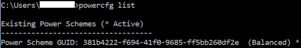

># ⭐Miscellaneous

<b>Learn to use the most common basic CMD Commands for Windows 10 and CMD Network Commands with their syntax and examples in this 
tutorial: </b>

Users of Windows have surpassed the usage of basic Settings and Control Panel while trying to gain access and control on every aspect of the network and features associated with the Operating system. This has led to the usage of CMD commands. Most of the commands are extremely popular, even with the not so tech-savvy users.

>####📕 What Is CMD :
CMD stands for Command (.CMD). A command is an instruction given to a computer program that tells the program what has to be done. It is an application that is found in most computers with Windows as the Operating System, and it helps in the execution of the commands entered. It is also called Command Prompt or Windows Command Processor.
******************
> ####📭 Basic CMD Commands:
#####
1) CD- Change Directory   

This command allows users to change from one directory to another or move from one folder to another.

Syntax: CD [/D] [drive:][path]
Example: C:>CD Prog

<image src="Images/CD-Change-Directory-1.png" align="center"></image>

Some of the other parameters of this command are discussed below. This will make this command more useful.

Parameter- cmd device: This parameter gives specific information about the device which will be used for input and output.

Parameter /d: This parameter is used when the user wants to change the current directory and the current drive as well.

##### 
2) Mkdir: 

This command is used when subdirectories are to be created within the directories.

Syntax: mkdir [<drive>:]<path>

Example: mkdir fantastic ( to create a directory name “ fantastic”)

##### 
 3) REN: Rename : 

Syntax: ren [<drive>:][<path>]<filename1> <filename2>

Example– ren /?

##### 
 4) ASSOC: Fix File Associations: 

This is one of the most basic and most common commands. It helps to associate (as the name suggests) some file extensions to some programs. For Example- When we click on .doc (extension), the computer is able to decide that it needs to associate it with Microsoft Word. The screenshot below shows an example of how this command works.

Syntax: assoc [.ext[=[fileType]]]

Example: – C:\Users\assoc.txt

####
5) POWERCFG: Power Configuration 

This command gives a report of the power settings of the computer. In situations when the power of the computer drains out quickly, this command can help to generate a complete power efficiency. The report is generated within a minute and is extremely useful to detect any warnings which may impact the performance of the system.

Syntax: powercfg /option [arguments] [/?]

Example: powercfg /?

Another parameter of this command is /list, /L. This parameter lists all the power sources.

*********************

 With All that : ❤️

 

<i>created by: Ismail Dakir,
Fallah Adnan</i>

&#169;

